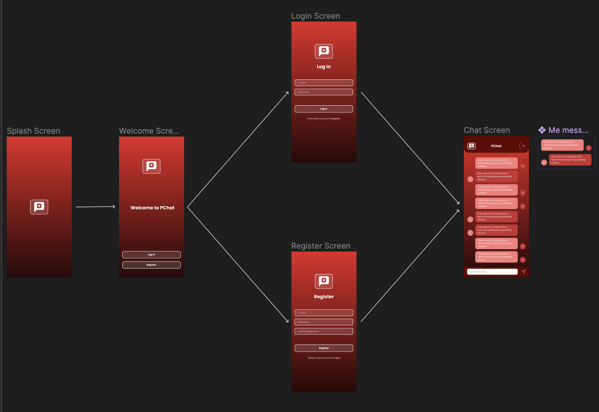

# SWIFT - MVC - PChat

 

Project repository **PChat** development with **Swift, UIKit, MVC, Constraints, Firebase (Authentication, Firestore), ViewCode, Protocol Delegate**

<h3 id="acessar-projeto">📁 Preview</h3>

    
   &nbsp;&nbsp;&nbsp;&nbsp;&nbsp;&nbsp;
  
   &nbsp;&nbsp;&nbsp;&nbsp;&nbsp;&nbsp;
  
  &nbsp;&nbsp;&nbsp;&nbsp;&nbsp;&nbsp;
 

     

    

<h3 id="acessar-projeto">📁 Initializing Clone</h3>

◽ Clone the repository using Git Bash + the command:

       $ git clone git@github.com:IMatheusPiresI/swift-chat.git

<h3 id="sobre">📍 About</h3>

✅ Developed with **Swift, UIKit, MVC, Constraints, Firebase (Authentication, Firestore), ViewCode, Protocol Delegate**.  
✅ Project created using MVC pattern. 
✅ Use Firebase Authentication for user access and change layout message.  
✅ Login and Register with Firebase.  
✅ Messages in real time using Firebase Firestore Listenner for observer change in database and reply on app.  
✅ Pchat is a group chat for all users created with Firebase.  
✅ Interfaces, icons, and color palette created by Me using Figma.  

<h3 id="autor">🌁 Figma</h3>

-> Access figma and check out the creation of the application and flow of screens. 
-> Link Figma Project: <a href="https://www.figma.com/file/W80kgphQps6M4s2eEqz1Es/PChat?type=design&node-id=0-1&mode=design&t=TqKBAiF83aUabYR9-0">Swift PChat Project</a>

    

<h3 id="autor">✒️ Author</h3>

  
